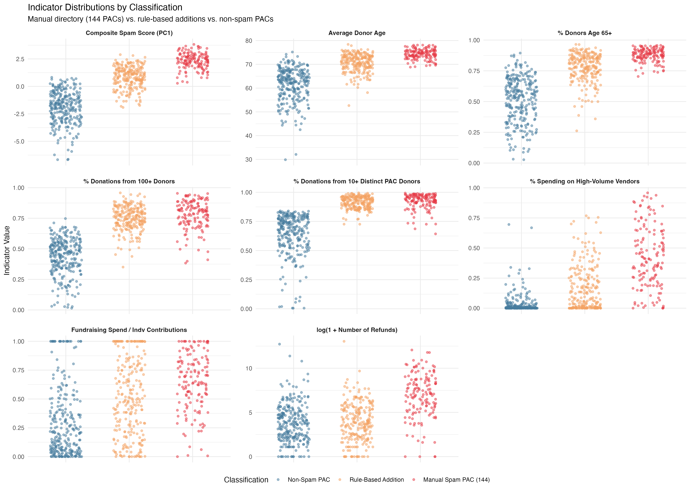
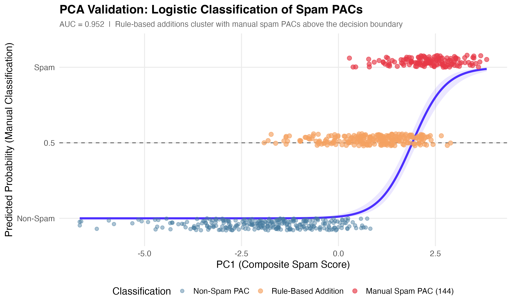

# Spam PACs — Replication Archive

This repository contains the data and code used to produce the empirical claims in the investigation published by Adam Bonica on spam PACs in Democratic small-donor fundraising. The analysis is built from public Federal Election Commission (FEC) filings via the Database on Ideology, Money in Politics, and Elections (DIME), Meta's public ad library, and the L2 national voter file.

This README covers the five components most relevant to replication: (1) how the spam PAC directory was constructed, (2) the data and code in this archive, (3) the Pascal-network disbursement coding, (4) the donor age estimation procedure, and (5) the PCA-based validation of the spam PAC directory.

## 1. Constructing the Spam PAC Directory

The set of spam PACs used throughout this analysis is the product of a manual coding pass conducted in October 2025. Working from FEC committee records, I went through every committee that scored on the high end of PAC metrics I was already tracking and applied two inclusion criteria. To be flagged as a spam PAC, a committee had to:

1. Show fundraising and spending patterns consistent with the spam PAC pattern in its FEC filings — heavy reliance on individual small-dollar contributions, high refund rates, large shares of receipts going to fundraising vendors, minimal independent expenditures or candidate contributions.
2. Either contract directly with a high-volume digital fundraising vendor, or be affiliated — officially or via shared treasurer networks — with another PAC that did. FEC data on treasurer cross-listings and inter-PAC transfers were the primary tools for mapping these affiliations.

For all major spam PACs in the resulting list, I documented examples of their fundraising texts or emails. The public archive at [politicalemails.org](https://politicalemails.org/) and the Facebook Public Ad Library were especially useful for this. These were supplemented by the numerous solicitation messages I have personally received via SMS and email over the relevant period.

That October 2025 pass produced **145 PACs** that met the criteria — the directory in `spam_pac_directory_final.csv` and the population used for every empirical claim in the article. The list is conservative by design and is not exhaustive. Subsequent analysis identified additional PACs that meet the same criteria — mostly newer entrants and smaller operations that didn't yet show up in my October sweep — but the analysis sticks to the original manual list. Holding the directory fixed at the October 2025 cut is what makes it possible to use the PCA model as pure validation rather than as a circular re-derivation of the same list (Section 5).

The substantive results are not sensitive to this choice. Because spam PAC fundraising is heavily concentrated in a few dozen of the largest PACs, swapping in a fully rule-based directory of 316 spam PACs derived from the PCA model leaves every reported figure essentially unchanged.

## 2. Data and Code

The main replication script `spam_pac_replication.R` reproduces every empirical claim in the article. It is organized into seven sections that can be read top to bottom or run as a whole.

**Data files** (in `data/`)

| File | Contents |
|---|---|
| `all_donors_dt.rds` | Contribution-level data with DIME donor IDs (`bonica_cid`) and recipient IDs (`bonica_rid`), covering all FEC individual contributions in the analysis window. **3.45 GB** — too large for the GitHub repo, so the script downloads it automatically on first run and caches it to `data/`. |
| `spam_pac_directory_final.csv` | The directory of identified spam PACs, mapping DIME recipient IDs to FEC committee IDs. |
| `high_volume_vendor_spending_mat.csv` | Matrix of disbursements to high-volume fundraising vendors, by recipient and cycle. Used to flag candidates whose campaigns rely on the same vendor infrastructure as the spam PAC ecosystem. |
| `pascal_network_disb_codings_final.csv` | All 50,000+ itemized Pascal-network disbursements with vendor, purpose description, amount, and final hand-coded category. |
| `committee_summary_2025_year_end.csv`, `candidate_summary_2025_year_end.csv` | FEC committee and candidate summary snapshots (year-end 2025) for top-line fundraising totals. |
| `comms_all_2018_2026.csv` | Long-form panel of FEC committee summary filings, used for the Pascal-network IE and contribution totals. |
| `cand_comm_directory.csv` | Directory mapping DIME IDs to candidate and committee names. |
| `donor_age_aggregate.csv`, `donor_age_aggregate_by_cycle.csv` | Donor age distributions, pre-aggregated to recipient × age and recipient × cycle × age. (Individual-level voter-file ages are not redistributed; the aggregations are sufficient for every figure in the piece.) |
| `spam_pac_indicators_for_pca.csv` | Indicator matrix for all PACs and candidates, used by the PCA validation script (`pca_validation.R`). Contains the eight indicators described in Section 5 for every federal PAC and candidate in the analysis window. |

**What the script produces**

1. **Macro ecosystem stats** — total donations to spam PACs, total raised, count and share of "hyper-donors" (100+ contributions across the spam ecosystem), and the share of all spam dollars they account for.
2. **Candidate / vendor overlap** — for the same hyper-donor pool, how much of their candidate giving flows to candidates whose campaigns use the high-volume fundraising vendors versus those that don't.
3. **Candidate donor profiles** — for Hakeem Jeffries (`cand43832`) and Jordan Wood (`cand167616`), the share of donations and dollars coming from spam PAC donors at three intensity thresholds (1+, 10+, 100+ spam PAC contributions), plus mean donor age and share aged 65+ by cycle.
4. **Donor age distributions** — full age-frequency CSVs for Jeffries, AOC, the DSCC, and the DCCC.
5. **65+ concentration by candidate** — share of each congressional candidate's donors aged 65+, ranked.
6. **Cycle totals comparison** — itemized vs. unitemized individual contributions for spam PACs, Senate Democratic candidates, and the DCCC + DSCC combined.
7. **Pascal network spending breakdown** — the Fundraising / Organizing / Payroll / Administrative / Contributions+IE table.

**Running the script**

```r
# from the repository root
setwd("path/to/replication-archive")
source("spam_pac_replication.R")
```

Required R packages: `data.table`, `dplyr`, `tidyr`, `stringr`, `stringi`, `purrr`, `glue`. The script will fail with a clear message if any are missing. On first run the script downloads `all_donors_dt.rds` (3.45 GB) and caches it to `data/`; subsequent runs use the cached copy. All output is written to stdout and to `output/` (age-frequency CSVs and the per-candidate 65+ table). Total run time is under five minutes on a modern laptop after the initial download.

**PCA validation**

A separate script, `pca_validation.R`, replicates the PCA-based validation of the spam PAC directory described in Section 5. It reads `spam_pac_indicators_for_pca.csv`, fits the PCA model, runs the leave-one-out robustness analysis, applies the rule-based diagnostic classification, and produces four figures in `figs/`. Additional required packages: `ggplot2`, `pROC`.

```r
source("pca_validation.R")
```

## 3. Coding Pascal-Network Disbursements

For the Pascal network — eight PACs that share infrastructure (Progressive Turnout Project, Stop Republicans, Stop Trump, Democracy First PAC, Dem Turnout 2024, Dem Turnout 2026, Progressive Takeover, and Turnout the Vote IE PAC) — every itemized FEC disbursement was hand-classified into one of six categories: Fundraising, Organizing, Payroll, Administrative, Contributions/IE, and Refunds. The Contributions/IE and Refunds categories are determined by FEC transaction type; the other four require coding.

The full file of 50,000+ line items, with the original vendor, purpose description, amount, and the assigned category for each row, is `pascal_network_disb_codings_final.csv` (also available as a [Google Sheet](https://docs.google.com/spreadsheets/d/1JvKtz4Eotqi6h4KmWuco-Bjbm2WPFvSkI0Ckon5Km6o/edit)). Any reader can verify any individual coding decision.

**Why we cannot rely on the PACs' self-reported FEC purpose descriptions**

FEC committees self-report the "purpose" line on each disbursement. The vocabulary is not standardized, and within the Pascal network the same vendor providing the same service has been described under at least four different labels — "fundraising," "digital advertising," "digital advocacy," and "digital organizing" — across filings. The labels have drifted in one direction over time: from descriptions that sound like fundraising toward descriptions that sound like programmatic work. Coding from the labels alone would systematically misrepresent what the money paid for.

The starkest case is "Digital Organizing." More than $30 million in Pascal-network spending is labeled "Digital Organizing" or similar in FEC filings. Roughly 90% of that money goes to three vendors: **Mothership Strategies, Message Digital, and Tatango**. These are digital fundraising firms whose core business is high-volume email and SMS solicitation. Mothership's own website opens with "We Do One Thing (and we do it really well): Online Fundraising," and every public statement Mothership has issued in response to prior reporting describes its work as fundraising. Message Digital and Tatango are similar.

For these three vendors a flat override is applied: payments to them are coded as **Fundraising**, regardless of the FEC purpose description. The same logic is applied to Pascal-network Meta ad spending. A systematic review of the network's Meta ad library shows that essentially every ad is a fundraising solicitation — none ask viewers to register to vote, find a polling location, check registration, or take a civic action. (One small line item, $31K for ads recruiting employees, is the only documented exception, accounting for about 0.05% of Meta spend.) Meta ad spending is therefore coded as Fundraising.

**Generous coding everywhere else**

The flip side of the vendor overrides is that judgment calls on ambiguous line items consistently break in favor of the PACs:

- The classification algorithm scans purpose descriptions for field-activity terms (FIELD, CANVASS, GOTV, DOOR, VOTER CONTACT, PHONE BANK, POSTCARD) and re-codes hits to Organizing even when the line item was originally classified as Administrative.
- Printing and postage costs are coded as Organizing unless I could independently verify they were used for fundraising mailers.
- Payments to staffing agencies that might supply either canvassers or back-office staff are coded as Organizing.
- Anything that could plausibly be GOTV-related is coded as such.

This biases the Organizing total upward — it represents an upper bound on what the network spent on election-related activity. With these generous codings applied, the final breakdown across the full Pascal network from 2015 through year-end 2025 is:

| Category | Amount |
|---|---|
| Fundraising | $249M |
| Organizing | $50M |
| Payroll | $50M |
| Administrative | $20M |
| Contributions / IE | $20M |

Total raised over the period: approximately $390M. Only Progressive Turnout Project itself conducts any direct organizing or voter-contact work; the other seven entities in the network function essentially as fundraising vehicles, with their receipts either transferred to PTP or spent on additional fundraising operations.

## 4. Estimating Donor Ages via Voter File Linkage

FEC contribution records do not include donor age, so contributor records are linked to the L2 national voter file (which contains date of birth) using a probabilistic record-linkage algorithm. The full methodology is published and peer-reviewed: Bonica and Grumbach, "Old Money: Campaign Finance and Gerontocracy in the United States," *Journal of Public Economics*, 2025.

For each FEC contributor the algorithm pulls candidate records from the voter file that share the same last name and state, then scores each candidate on:

- **Name agreement** — exact, fuzzy (Jaro-Winkler), or nickname-resolved matches on first name; middle-name/initial agreement; with all scores adjusted for name frequency (a "James Smith" match earns fewer points than a rare-name match).
- **Address and location agreement** — exact, partial, and fuzzy matches against both residential and mailing addresses on the voter file; agreement on city, state, and ZIP at three levels of precision; plus geographic distance between the geocoded coordinates of the two addresses.
- **Singleton bonus** — a small adjustment when only one plausible candidate exists in the block.

The highest-scoring candidate is selected only if its total score clears a confidence threshold; below the threshold the donor is left unmatched rather than risk a bad link. The vast majority of successful matches are straightforward — donor and voter-file records agreeing on name, street address, city, and state. The scoring machinery is needed mainly for harder cases and to reject near-misses.

Once a donor is matched, age is computed at the time of *each contribution* (so a donor giving in both 2018 and 2024 is recorded at two different ages). Statistics like average donor age or share of donors aged 65+ are computed from those per-contribution ages, then pre-aggregated into the donor-age tables included in `data/`.

## 5. Validating the Spam PAC Directory with PCA

The 145-PAC directory described in Section 1 is held fixed throughout the analysis. PCA's role is to validate it: to check, quantitatively, that the PACs flagged through the manual coding actually share a common spam-like profile across multiple independent dimensions, and that the dividing line between flagged and unflagged PACs reflects a real cluster in the data rather than an arbitrary judgment call.

The validation works as follows. For every federal PAC active since 2017 with at least 500 unique donors (the threshold required for stable indicator estimates), eight indicators are computed:

- `mean_age` — average estimated age of donors.
- `pct_65_plus` — share of donations from donors estimated to be 65 or older. Paired with `mean_age` because the two capture different parts of the age distribution.
- `pct_overall_donations_100plus` — share of a PAC's donations coming from donors who have made 100 or more contributions to any federal candidate or committee. This measures the concentration of hyper-frequent givers in a PAC's donor base, independent of the spam PAC list itself.
- `pct_overall_donations_10plus_distinct` — share of a PAC's donations coming from donors who have given to 10 or more distinct federal committees. Same construction, lower threshold; captures heavily solicited donors who haven't yet reached the hyper-frequent tier.
- `high_volume_vendor_pct` — share of total disbursements paid to firms specializing in high-volume, small-dollar digital fundraising (Mothership Strategies, Sapphire Strategies, Switchboard, MissionWired, Liftoff Campaigns, Message Digital, and a number of others). The vendor list was constructed conservatively: a firm is included only if (a) independent research confirmed it engages in high-volume digital fundraising and (b) it appears in disbursement records for already-flagged spam PACs.
- `fundraising_inefficiency` — fundraising and operational costs divided by total individual contributions. Individual contributions are used as the denominator (rather than total receipts) because PAC-to-PAC transfers do not require the fundraising vendor infrastructure that drives these costs. For comparison, the Better Business Bureau's Wise Giving Alliance standard for charities is no more than 35 cents on the dollar.
- `log_hvv_total` — log-transformed total spending on high-volume fundraising vendors. Captures the absolute scale of vendor engagement in addition to the share.
- `log_n_refunds` — log-transformed count of donor refunds. Elevated refund volumes indicate donors being charged in ways they didn't expect — repeat donors discovering recurring charges they didn't authorize, family members reversing transactions, etc.

The eight indicators are combined using principal component analysis. The first principal component (PC1) captures the dimension along which they jointly vary; PACs scoring high on PC1 are PACs that exhibit the spam-like profile across many indicators at once. The 145 manually coded spam PACs cluster sharply at the high end of PC1, well separated from the rest of the PAC universe — the validation succeeds.





The fitted logistic model implies a classification threshold: PACs whose predicted probability of being a spam PAC exceeds the cutoff are flagged, those below are not. Applying that threshold to the full PAC universe partitions the directory into two groups:

- **All 145 manually coded PACs** clear the threshold. The indicator profile and the manual coding fully agree.
- **172 PACs not in the manual list** also clear the threshold. These are mostly newer entrants and smaller operations that didn't surface in the October 2025 sweep but match the spam profile on the indicators.

The PACs above the threshold combined yield the fully rule-based directory of **317 PACs** (145 manual ∩ rule-based + 172 rule-based only). For the results in the article, it makes essentially no difference whether the manual or rule-based directory is used. The reason is concentration: the core set of large spam PACs accounts for **over 98% of total spam PAC donation activity**. The 172 additional rule-based PACs are real but each is a small fraction of the ecosystem; including or excluding them moves the reported estimates by at most a percentage point or two.

Two robustness points matter for interpreting this:

1. **The aggregation method does not drive the result.** Because the indicators are highly correlated, a simple additive index over standardized indicators produces nearly the same ranking as PCA.
2. **The model is robust to dropping any single indicator.** Removing any one indicator and re-fitting the PCA yields essentially the same separation between hand-coded spam PACs and the rest. The replication archive includes a drop-one-indicator analysis demonstrating this. (For this reason the high-volume vendor list — the only indicator built on judgment calls about specific firms — is not analytically necessary. The validation holds with or without it, and none of the vendors are named in the article's quantitative claims.)

## Citation

To cite this code or data:

> Bonica, Adam. 2026. "Hook and Squeeze." *On Data and Democracy*

> Bonica, Adam, and Jacob Grumbach. 2025. "Old Money: Campaign Finance and Gerontocracy in the United States." *Journal of Public Economics*.

## Contact

Adam Bonica · Stanford University · bonica@stanford.edu
